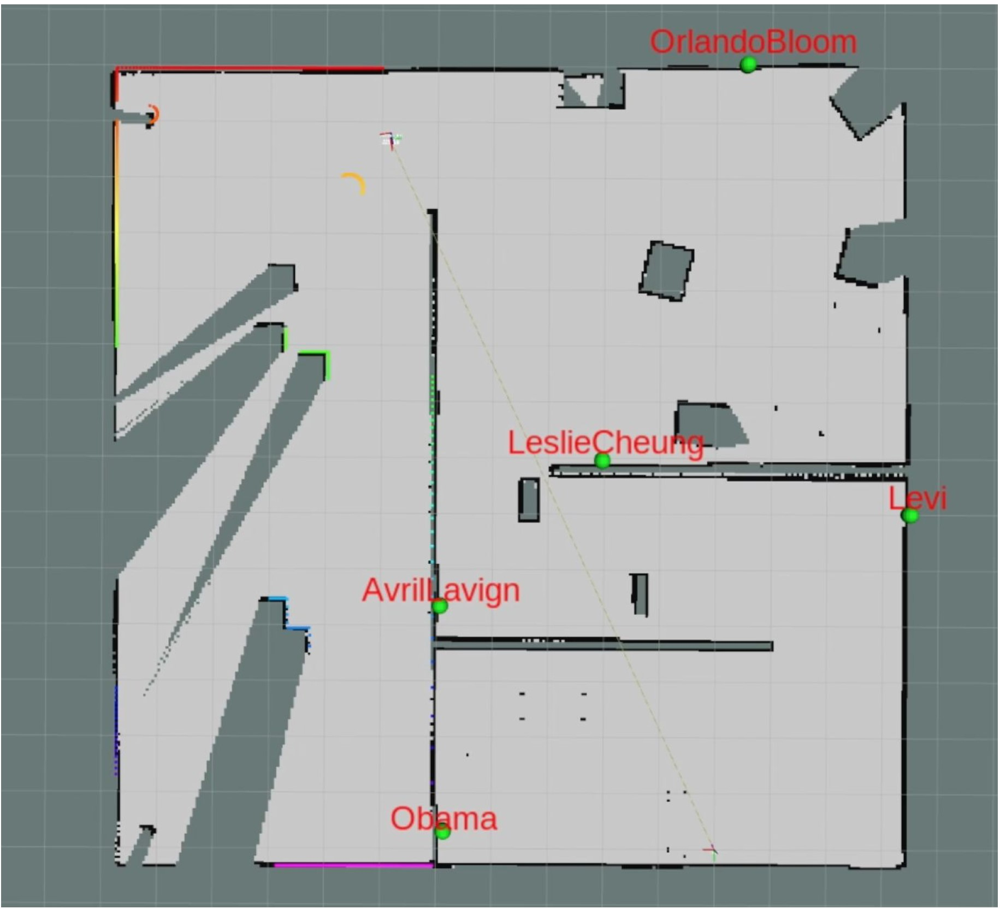

## Introduction
The mobile robot creates a map of its environment using a Lidar sensor while moving around. Using a camera, it is able to detect posters of faces that are placed on the walls of the environment. It recognizes 5 different humans and puts a marker on the map where the respective image is located.
In the virtual environment there is also a ball that moves around, which the robot is able to autonomously track and follow. The ROS nodes are written in C++ and Python.

### Virtual Environment

### Created Map

### Demonstration

## Instructions

### Prior to start

- Copy the src and picture folders to your catkin_workspace

- in <opencv_apps/launch/face_recognition.launch> change the absolute path of the <data_dir> to include our picture folder which trains the face_recognizer

- catkin_make workspace
	- if needed install required packages
	- for other errors please refer to error fixing section in this file

- Start roscore

- Start ./vrep_sh (make sure the vrep_ros interface is set up correctly)
	- Load Scene (env.ttt)
	- Start Scene

### Launch for Demo Part 1

- cd to catkin_ws/src/project_launch
- $ . ~/"directory of catkin_ws"/devel/setup.bash
- $ roslaunch project_all.launch
- CTRL-C to stop the nodes before Demo Part 2

### Launch for Demo Part 2
- cd to catkin_ws/src/project_launch
- $ . ~/"directory of catkin_ws"/devel/setup.bash
- $ roslaunch project_ball.launch

## Installation Error Fixing

### haarcascade error
make sure that <haarcascade_frontalface_alt.xml> and the <haarcascade_eye_tree_eyeglasses.xml> are found by either changing the absolute path in <face_detection.launch> or by copying the files to the set directory

### Ros version
we used ros melodic for the Demo, 
change either ros version or files if needed

especially in CMakeLists.txt of vrep_ros_interface, change to actual ros version at <link_directories("/opt/ros/<ros_version>/lib")>

### After ZIP Download
These errors can occur when files are downloaded from a zip folder:
If permission denied for cfg files in opencv (while trying to catkin_make) do:
chmod +x <directory of catkin workspace>/src/opencv_apps/cfg/ -R

If a node can’t be launched, do: (will probably be keyboard_vel.py file)
chmod +x <directory of the node file in the src folder>
		If the file that can’t be launched is keyboard_vel.py:
chmod +x <directory of catkin_ws>/src/keyboard_vel/src/keyboard_vel.py

### compiler error
in CMakeLists.txt of vrep_ros_interface add after the package name: add_definitons(--std=c++11)

### laser_scan orientation in map
if the laser scan data does not match the walls, change in slam_gmapping.cpp the direction of the unequal sign at <if (up.z() < 0)>
